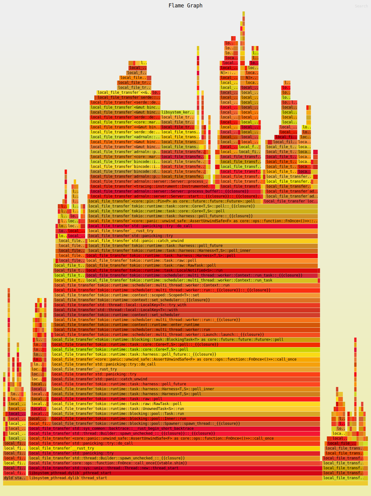

# adrnaln

Problem statement: It is desired to send any type of file across UDP with low latency or metadata overhead.

```
This library is a toy example of how that might be accomplished.
It is a toy, as it does not implement retry mechanisms, backoff, telemetry etc..
```

## Implementation


This library uses `bincode` to assist in the serial/deseralisation of `Packet` structs.
These structs contain chunks from input file and also have global metadata about the sequence construction.

## Usage

`cargo test` to run a synthetic test.

Run the example `cargo run --example local_file_transfer -- --filepath <FILEPATH>` ( This will currently spit the file into the cwd )

### Performance

#### Flamegraph 
To analyze performance use `flamegraph` ( cargo install flamegraph )

```
sudo cargo flamegraph --dev --example local_file_transfer -- --filepath <FILEPATH>
```



#### Tracing

```
docker run -d -p6831:6831/udp -p6832:6832/udp -p16686:16686 -p14268:14268 jaegertracing/all-in-one:latest
```


Create a trace:

```
RUST_LOG=trace RUSTFLAGS="--cfg tokio_unstable" cargo run --example local_file_transfer -- --filepath=examples/resources/fox.png
```